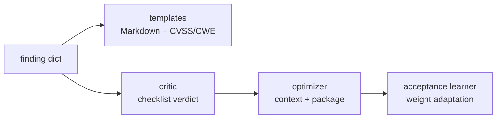

# ReportSmith

Technical security report generation: templates, critic, optimizer,
acceptance learning. Stdlib-only, deterministic, no LLM required.

Extracted (copied, not moved) from a private autonomous-work OS. The monorepo
keeps evolving independently; this package is a stable, tested snapshot.

## What it does

- **Templates** (`render_report`) — platform-shaped Markdown reports
  (HackerOne/Bugcrowd/…-style sections) from structured finding dicts, with
  CVSS vectors and CWE references.
- **Critic** — rule-based checklist review (evidence exists? steps to
  reproduce? impact stated?) with pass/fail items and a verdict.
- **Optimizer** — assembles report context (quality score, acceptance
  probability, critic verdict, remediation) and emits a ready-to-submit
  package. Event-bus publish degrades silently outside the origin system.
- **Acceptance learner** — adapts dimension weights from observed outcomes
  (accepted/rejected), persisted locally when available.
- **Copilot review primitives** — deterministic `FindingAnalyzer` +
  `CopilotReview` (checklists, no model calls).

## Quick start

```bash
pip install -e ".[dev]"   # Python ≥ 3.11, zero runtime dependencies
pytest -q                 # 45 tests, offline
```

```python
from reportsmith.reports import ReportCritic, render_report

finding = {
    "id": 7,
    "title": "IDOR on /api/orders/{id}",
    "description": "Sequential IDs, no ownership check.",
    "severity": "high",
    "vulnerability_type": "idor",
    "evidence": ["GET /api/orders/101 → 200 (other user)"],
}
print(render_report("hackerone", finding)[:200])
print(ReportCritic().evaluate(finding).verdict)
```

## Architecture



## Limitations (honest)

- Rule-based, not AI: the critic checks structure and completeness, it does
  not judge exploitability. A well-written wrong report still passes.
- CVSS vectors are representative templates per severity, not computed scores.
- Full optimizer context (DB session, event bus, recovery store) degrades to
  local-only outside the origin system; inject your own builder for production.
- No auto-submission included: review output, then submit through the
  platform yourself.

## License

MIT — see [LICENSE](LICENSE).
